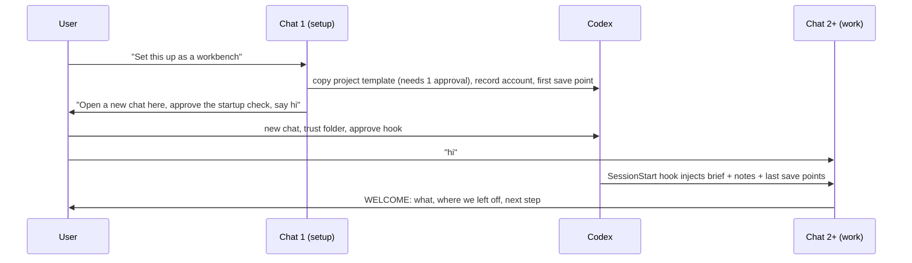

# Host: ChatGPT / Codex, project setup and the startup hook

Scope: the user uses only OpenAI's products, ChatGPT and Codex (the Codex desktop app, CLI or IDE extension). This note covers how the skill gets into a project folder, and how every new chat starts with a welcome that orients both the user and the AI. Research date 2026-09-29.

Tags: `[UNVERIFIED]` means not confirmed from a primary page. `[INFERENCE]` is my reasoning. `[LOCAL]` means tested on this machine: Windows 11 26200, Codex CLI 0.157.1, driven with `codex exec` against a real ChatGPT sign-in. The Codex desktop app's UI was not tested.

## The user's workflow (as specified by the user)

1. The user creates an empty folder and opens Codex in it.
2. The user asks: "Set this up as a workbench."
3. The agent installs the skill and the startup check into the folder, then asks the user to start a **new chat in the same folder**.
4. From then on, each new chat opens with a short welcome: what the project is, where we left off, and the one next step. In a brand-new project, the next step is the interview.



## Recommendations

1. **Use two layers: a SessionStart hook for fresh state, and `AGENTS.md` as the backstop.** Both were tested [LOCAL]:
   - **Hook trusted.** The hook injected the brief, the notes and the last 5 save points. The first reply was the welcome, with no tool calls: 7 s and about 17k input tokens.
   - **Hook not trusted (untrusted folder or unreviewed hook).** The hook was skipped *silently*; `codex exec` gave no warning. `AGENTS.md` still loaded in the untrusted folder. It told the AI to read the same files itself, and the welcome still came, but slower: 28 s, about 51k input tokens and 4 tool calls. The model also narrated what it was doing first.
   - So the hook is the fast, clean path and `AGENTS.md` guarantees the welcome whatever the user clicked. Docs agree: `AGENTS.md` is rebuilt at the start of every session, and a hook is needed only for computed content [3][1].
2. **The hook fires on the user's first message, not when they open the chat.** `startup` is queued when the chat is created and runs at the start of the first turn [26][29][42]. That is why the setup chat's last instruction is "open a new chat here and type **hi**". Whatever they type first gets the welcome in reply; the brief says so.
3. **Match `startup|clear` only.** Those are brand-new chats and cleared contexts. `resume` and `compact` would re-greet them mid-work [1][29]. After compaction the AI keeps its own summary. Re-injecting the rules on `compact` is a possible later addition (open question).
4. **Plain text on stdout, not JSON.**
   - Plain stdout becomes developer context that only the model sees [1][26]. Tested [LOCAL].
   - JSON `systemMessage` would show the user a line, but the UI renders it as a *warning* [1][30]. To a non-programmer that looks like an error, so skip it. The AI's welcome is the user-facing message.
   - Keep the output under ~2,500 tokens (the default cap) or set `additionalContextLimit`. Overflow is spilled to a temp file and only a preview is injected [1][25]. The prototype sets 4000.
5. **Windows: a Windows PowerShell 5.1 script via `commandWindows`, no Node.** The hook must work before Node is installed, because setup and the interview come before any build.
   - Hook commands run through the session shell, which is PowerShell on Windows, not cmd [23][35]. Use no cmd syntax, and never a quoted program path as the first token (openai/codex#46454) [33].
   - `powershell -NoProfile -NonInteractive -ExecutionPolicy Bypass -File …` ran here [LOCAL]. `Bypass` applies to that one process. It does not change a policy, and it cannot beat a Group Policy-set one [03a].
   - Set UTF-8 output explicitly, because Codex decodes stdout as UTF-8 [23].
   - Known bug: if the session shell resolves to the Microsoft Store `pwsh.exe`, all command hooks fail with os error 5 (#47810, open) [34]. `AGENTS.md` covers that case.
6. **macOS: a POSIX `sh` script that never calls `/usr/bin/git` unless the CLT exists.** The git stub pops the Xcode tools installer, which asks for admin [03a rec 24]. The script checks `xcode-select -p` or a non-stub git first. Untested (no Mac).
7. **Setup needs three clicks from the user. Say so up front, in their words.**
   - **Approve writing the settings folders [LOCAL].** In the default sandbox, writes to `.codex/` and `.agents/` were rejected ("writing outside of the project; rejected by user approval settings"). Only `AGENTS.md` and `git init` succeeded. In the app the user gets an approval prompt instead [38]. So the setup agent copies the whole project template in **one** shell command, to ask once rather than once per file.
   - **Trust the folder.** Project hooks load only when the project's `.codex/` layer is trusted [1][2]. For a folder with no git checkout, no root marker and no `.codex/`, the app does not persist trust at chat start, and does not pre-approve config added later [32]. So the setup chat's own trust doesn't carry over; `git init` plus the new chat is what makes the folder trustable [INFERENCE]. The shipped setup makes no `.git` (its history is `.workbench/history`), so whether trust needs a real repository is untested. Tested [LOCAL]: trusted folder + unreviewed hook = skipped.
   - **Review the startup check.** Each hook is trusted by the hash of its definition. It is reviewed with `/hooks` in the CLI or through an in-app flow, and is skipped until then [1][24][22]. Any later edit to `hooks.json` needs a new review [24]. So the template's hook must be final, and dynamic content belongs in the files it reads, never in the hook definition.
   - The agent must never self-approve: no `--dangerously-bypass-hook-trust`, and no editing `~/.codex/config.toml` trust entries.
8. **Where the skill comes from before the folder has it: a one-time, user-level install of a small setup skill.**
   - Codex loads user skills from `~/.agents/skills` and repo skills from `<repo>/.agents/skills`, and triggers them implicitly from their `description` [4]. A user-level `workbench-setup` skill whose description matches "set this up as a workbench" makes step 2 of the user's workflow work as they would phrase it.
   - Its job is to copy `assets/project-template/` into the folder and nothing else. The full `workbench` skill lives in the project (`.agents/skills/workbench/`), so each project keeps the version it was built with.
   - How the user installs it once: via Codex's `$skill-installer` from the published repo, or a plugin marketplace (`codex plugin marketplace add owner/repo`) [4][7]. Exact install wording is [UNVERIFIED]; test it when the skill repo exists.
   - Skills can't ship hooks; plugins can [4][6]. A plugin's hooks would run in **every** Codex session on the user's machine, though, so the hook belongs in the project template, not in a plugin [INFERENCE].
9. **What the user needs installed.**
   - The Codex CLI installer is per-user (`%LOCALAPPDATA%`, user PATH, no admin) [16].
   - The Windows *app* comes from the Microsoft Store, and its enterprise docs say "an administrator must approve the installation" [15]. So on a managed laptop the app may be blocked where the CLI is not [UNVERIFIED for personal PCs].
   - Codex's recommended "elevated" Windows sandbox needs one admin-approved setup; without it Codex falls back to the unelevated sandbox, which needs no admin [10].
   - Codex is included in every ChatGPT plan from Free upward [12]. CLI access on Free/Go is [UNVERIFIED].
10. **ChatGPT without Codex cannot host this.**
    - ChatGPT chat/web doesn't read local config, runs no local hooks, and connects only to *remote* MCP servers [18][19][20].
    - ChatGPT Projects have instructions and files, which act as a static brief, but no folder access [17].
    - The skill therefore requires the Codex surface (app, CLI or IDE). Plain ChatGPT is at most the place for the "3.0-lite" copy-paste fallback ([04b](04b-software-3-local-mcp.md)).

11. **Updating: the user says "update the workbench" and the AI does the rest.** Each project keeps the skill version it was built with (rec 8), so updates are explicit, per project, and undoable. The procedure ships inside the skill (`.agents/skills/workbench/update.md`), so it works in any project even without the user-level setup skill.
    1. **Check.** Read `.workbench/VERSION` (version, date, source repo, commit). Ask GitHub for the latest *tagged release* of that repo (`https://api.github.com/repos/<owner>/workbench/releases/latest`). Same version: "You're up to date." Only tagged releases, never the main branch, and never a download address found in a document, chat or web page: that would let hostile text choose what runs [INFERENCE]. Shipped: the AI also resolves the tag to its commit and downloads that exact commit, because a tag can be moved.
    2. **Download** the zip of that exact commit (`https://github.com/<source>/archive/<sha>.zip`) into `.workbench/update/` with `curl.exe` and unpack with `tar -xf`. Both ship with Windows 10+ and macOS, so no git or Node is needed [INFERENCE for Windows versions; `tar` used in [03a](03a-default-stack-runtime.md)].
    3. **Tell the user what changes, in plain words.** The 2–3 lines from the release's `CHANGES.md` (written for users, not developers), and separately one line each for anything that changes what runs by itself (the startup check, the helper scripts), what gets downloaded, or what the AI may read, change or send (the skill files); if the AI can't tell what a change does, it says so. Then ask once: "Update now? I'll make a save point first so we can go back." Nothing is applied without a yes.
    4. **Keep a way back the update can't touch.** Copy every owned path (list in step 5) as it is now into `.workbench/update/before/`, and make a save point ([06](06-build-loop.md)) "before updating the workbench". If the check after replacing (the new startup check runs and prints the brief; `git.cmd log -1` works) fails, recover from that copy, not with the new helpers: delete the owned paths, copy `before/` back, compare file hashes, tell the user it is back as before. Never restore the whole project.
    5. **Replace only files the skill owns:** `.agents/skills/workbench/`, `.workbench/scripts/`, `.workbench/session-brief.md`, `.codex/hooks/`, `.codex/hooks.json`, `AGENTS.md`, `.gitignore`, `.gitattributes` and `.workbench/VERSION`. Each owned folder is deleted and recopied, so files a release removed are gone too. **Never touch** what belongs to the user: `CONTEXT.md`, `.workbench/NOTES.md`, `.workbench/account`, `.workbench/history/` and `.workbench/snapshots/`, `app/`, `samples/`, `.tools/`, `tool/`, the backup folder and the tool's data (both in `%LOCALAPPDATA%`, [03b](03b-data-storage.md) rec 3). If `AGENTS.md` was edited by hand, keep the old one as `AGENTS.old.md` and say so; for `.gitignore` and `.gitattributes` keep the new lines plus any the project added.
    6. **`.codex/hooks.json` stays as it is** unless the release really changes the hook definition. Codex re-asks for review on any change to it (rec 7), so the definition is kept stable across versions and everything that changes lives in the scripts and files it reads. If a release must change it, say so first: "Codex will ask you to review the startup check again."
    7. **Notes changes are proposals.** If a release suggests a change to `NOTES.md` or `CONTEXT.md`, the AI shows the exact change and applies it only if the user says yes.
    8. **The user-level setup skill** (`~/.agents/skills/workbench-setup/`) is outside the project, so it is refreshed only after a separate question ("Also update the setup for new projects? That changes a folder outside this project.") and only on yes.
    9. **Finish:** only now write the new `.workbench/VERSION` (version, date, same source, commit), make a save point ("Updated the workbench to v1.3"), delete `.workbench/update/`, and ask the user to open a new chat, because skills and the brief load at the start of a chat [4]. "Go back to before the update" restores the save point.
    - **No automatic checks.** Nothing contacts GitHub unless the user asks. The welcome may mention an old version from the date in `VERSION` alone ("Your workbench is from March. Say 'update' to get the latest."), after about three months [INFERENCE: threshold is mine].
    - **Security note.** Codex trusts a hook by the hash of its *definition* in `hooks.json` [24], so a new version of the script it runs is not reviewed again [INFERENCE: the script's contents are not part of the hash]. That is what makes quiet updates possible, and it is why updates come only from the fixed source, as an exact commit, and the AI shows the user what changed before applying them. Whoever controls that repository controls what an update contains, and releases are not signed. **Open decision for the maintainer:** authenticated (signed) releases for updates.
    - **What the published repo needs:** tagged GitHub releases; `skills/workbench-setup/`, `template/` (the project template, including `.agents/skills/workbench/`) and a user-facing `CHANGES.md`.

## Project template (what setup copies)

```
<the user's folder>/
  AGENTS.md                                 # backstop: how to start a chat if the hook didn't run
  CONTEXT.md                                # the user's words for their work (09); created with the first word
  .agents/skills/workbench/SKILL.md ...     # the full skill (interview, vocabulary, build loop)
  .codex/hooks.json                         # SessionStart hook definition (never edited after setup)
  .codex/hooks/session-start.ps1            # Windows
  .codex/hooks/session-start.sh             # macOS
  .workbench/session-brief.md               # fixed rules + "first reply" instructions
  .workbench/NOTES.md                       # project notes (06 skeleton); starts "Interview: not started"
  .workbench/VERSION                        # skill version, release date, source repo (rec 11)
```

`.workbench/NOTES.md` is the project-notes skeleton from [06](06-build-loop.md) rec 19, plus an `Interview:` line and a `Next:` line. The skill updates it at the end of every iteration. The hook only reads it. `CONTEXT.md` is the shared word list from [09](09-context-file.md); it sits at the root so the user can find and edit it. Both hooks below read it too; the Windows one was re-run with that change [LOCAL], the macOS one is untested. The project was renamed from "vibe coding" to "workbench" after the tests; only names and paths changed.

The shipped template also holds `.gitignore` and `.gitattributes`, `.workbench/scripts/` (`bootstrap.ps1`, `run.cmd`, `git.cmd`, `save.ps1`, `save.sh`, `account.ps1`, `account.sh`) and `.workbench/account` (written by setup; see the account gate below).

### `.codex/hooks.json` (tested on Windows [LOCAL])

```json
{
  "description": "Workbench: brief the AI on the rules and the project's state at the start of every new chat.",
  "hooks": {
    "SessionStart": [
      {
        "matcher": "^(startup|clear)$",
        "hooks": [
          {
            "type": "command",
            "command": "sh .codex/hooks/session-start.sh",
            "commandWindows": "powershell -NoProfile -NonInteractive -ExecutionPolicy Bypass -File .codex/hooks/session-start.ps1",
            "timeout": 15,
            "statusMessage": "Getting your project ready",
            "additionalContextLimit": 4000
          }
        ]
      }
    ]
  }
}
```

The relative paths assume Codex starts at the project root. The app's primary folder is the root [17]. Hooks run with the session cwd [1].

### `.codex/hooks/session-start.ps1` (tested [LOCAL])

```powershell
# SessionStart hook (Windows). Needs only Windows PowerShell 5.1: no Node, no Python.
# Plain text on stdout becomes context for the AI only; the user never sees it.
$ErrorActionPreference = 'SilentlyContinue'
[Console]::OutputEncoding = New-Object System.Text.UTF8Encoding $false

$root = git rev-parse --show-toplevel 2>$null
if (-not $root) { $root = (Get-Location).Path }
function Read-Part($rel) {
  $p = Join-Path $root $rel
  if (Test-Path -LiteralPath $p) { (Get-Content -Raw -Encoding UTF8 -LiteralPath $p).Trim() } else { "(missing: $rel)" }
}
$saves = (git -C $root log -5 --format='%ad  %s' --date=short 2>$null) -join "`n"
if (-not $saves) { $saves = '(no save points yet)' }
$unsaved = @(git -C $root status --porcelain 2>$null).Count

@"
# Workbench session brief (from the startup hook)

$(Read-Part '.workbench/session-brief.md')

## Our words (CONTEXT.md)
$(Read-Part 'CONTEXT.md')

## Project notes (.workbench/NOTES.md)
$(Read-Part '.workbench/NOTES.md')

## Last save points
$saves

Unsaved changed files right now: $unsaved
"@
exit 0
```

If git is missing, the script still works: it reports no save points. The git-free undo tiers are in [03a](03a-default-stack-runtime.md) rec 24.

**What the shipped hook does differently (Windows).** It sets `$root` to the current folder (no `git rev-parse`), runs git with `--git-dir .workbench\history --work-tree <root>` (from `.tools\git\cmd\git.exe` if present, else `git`), and adds an **account gate** before any notes reach the AI. `.workbench\scripts\account.ps1` reads Codex's `auth.json` and prints `personal <id>`, `company <id>` (`<id>` = first 12 hex digits of the SHA-256 of the ChatGPT account id) or `unknown`; setup writes that line to `.workbench/account`, or `unverified` when the sign-in is kept in the system keyring and can't be read. The hook prints `CONTEXT.md` and `NOTES.md` only if the current sign-in matches the recorded line exactly, or the record is `unverified` and the sign-in is still unreadable; otherwise it prints a "withheld" notice that sends the AI to "Account type" in `safety.md`. Tested with synthetic auth files [LOCAL]; keyring sign-ins are untested. `AGENTS.md` (shipped) runs the same check by hand when the hook did not run, before reading any notes. Rationale and limits: [08](08-security-compliance.md) rec 4.

### `.codex/hooks/session-start.sh` (macOS; untested)

```sh
#!/bin/sh
# Never touch /usr/bin/git unless the Command Line Tools exist: the stub pops an admin installer.
gitok() { g=$(command -v git) || return 1; [ "$g" != /usr/bin/git ] || xcode-select -p >/dev/null 2>&1; }
root=$(pwd); gitok && root=$(git rev-parse --show-toplevel 2>/dev/null || pwd)
part() { [ -f "$root/$1" ] && cat "$root/$1" || echo "(missing: $1)"; }
echo "# Workbench session brief (from the startup hook)"; echo
part .workbench/session-brief.md; echo
echo "## Our words (CONTEXT.md)"; part CONTEXT.md; echo
echo "## Project notes (.workbench/NOTES.md)"; part .workbench/NOTES.md; echo
echo "## Last save points"
if gitok; then git -C "$root" log -5 --format='%ad  %s' --date=short 2>/dev/null || echo "(no save points yet)"
  echo; echo "Unsaved changed files right now: $(git -C "$root" status --porcelain 2>/dev/null | wc -l | tr -d ' ')"
else echo "(git not available; see snapshots)"; fi
```

### `.workbench/session-brief.md` (the fixed part; tested wording)

```markdown
You are helping an office worker build a small tool on their own computer. They use a computer all day but don't write code, and they know their own work better than anyone: ask them about it when that's quicker than checking (see 09 "Who the user is"). Follow the workbench skill in `.agents/skills/workbench/`.

Rules that never change:
- Nothing may need administrator rights. Nothing leaves this computer without the user knowing where it goes.
- The user never chooses technology. Use the words in CONTEXT.md, never jargon. Ask only what they can answer from their own work, one question at a time, with your suggested answer (see 09).
- One small change at a time: show a sketch first, build it, let them try it, then make a save point.

First reply of this chat (do this before anything else, whatever the user wrote):
1. Greet the user with a welcome in 4 short lines or fewer: what this project is (from NOTES.md, or "a new project" if NOTES.md is empty), where they left off (from the last save points), and the single next step.
2. If NOTES.md says the interview is not done, the next step is the interview: ask your first interview question.
3. Otherwise ask: "Shall we continue with <next item>, or is something not working?"
```

### `AGENTS.md` (backstop; tested in an untrusted folder [LOCAL])

```markdown
# Workbench project

This folder is a workbench project: an office worker who doesn't write code is building a small tool for their own work. The skill in `.agents/skills/workbench/` has the full process.

At the start of every new chat:
- If your context already contains "Workbench session brief", the startup hook ran: follow that brief.
- Otherwise the hook did not run (folder or hook not yet approved). Read `.workbench/session-brief.md`, `CONTEXT.md` and `.workbench/NOTES.md` yourself, run `git log -5 --format="%ad  %s" --date=short`, and follow the brief. After the welcome, add one line: "Tip: if Codex asked you to review a startup check for this folder, approve it so I can get ready faster."
```

**Observed welcome** (hook trusted, sample notes, first message "hi") [LOCAL]:

> Hi! We're building your resume sorter, which puts resumes into one table.
> Last time, opening resumes and viewing them in the table worked; one file has unsaved changes.
> Next, we'll add exporting the table to Excel. Shall we continue with that, or is something not working?

### Setup chat's closing message (template)

> Your project folder is ready. Three quick things, then we start:
> 1. Open a **new chat** in this same folder.
> 2. If Codex asks whether to trust this folder, choose **Trust**. If it asks you to review a **startup check**, approve it. It only reads your project notes.
> 3. Type **hi**. I'll welcome you and we'll begin with a few questions about the task you want help with.

## Key evidence

- **Hooks.** Stable and on by default since GA on 2026-05-14 [1][2][22]. The feature is listed `hooks … stable true` by `codex features list` [LOCAL].
  - Events, schema, `commandWindows`, stdout → developer context, the `systemMessage` warning, the ~2,500-token cap and spilling [1][25][26].
  - Session shell execution on Windows [23][28][35].
- **Trust.** The project-layer trust gate [1][2][36] and per-hook hash trust [1][24][37]. No trust for projectless folders at `thread/start` [32]. Both gates reproduced [LOCAL].
- **AGENTS.md.** Discovery root→cwd, rebuilt each session, 32 KiB default [3]. Loads in an untrusted folder [LOCAL].
- **Skills and plugins.** Locations, implicit triggering, detection of changes without a restart ("If an update doesn't appear, restart Codex") [4]. Plugins bundle hooks; skills don't [6][7].
- **Sandbox.** `.codex`/`.agents` are protected paths in writable roots [38]. Writes were rejected without approval [LOCAL].
- **ChatGPT.** Remote-only MCP [19][20][21]. Projects have no folder access [17].

## Open questions

- **The desktop app's UI was not tested.** Unknowns: whether a new chat in a freshly set-up folder shows a trust prompt, how the in-app hook review looks, and whether `statusMessage` shows. This is the most important hands-on check. It is ten minutes with the app.
- **Does a new chat pick up `.agents/skills` created during the previous chat without restarting the app?** Docs: "detects skill changes automatically… if an update doesn't appear, restart Codex" [4]. `AGENTS.md` points at the skill path explicitly, which worked in the backstop test (the model tried to open `SKILL.md`).
- **Re-inject on `compact`?** A long session loses the brief after compaction unless the matcher includes `compact`. That trades a re-greeting risk for rule retention. The brief could say "on compact, don't greet".
- **The IDE extension and Codex cloud** don't document hooks [UNVERIFIED]. `AGENTS.md` covers them.
- **Managed laptops** can disable hooks through `requirements.toml` [1]. `AGENTS.md` covers that too.
- **The exact one-time install command** for the user-level setup skill (rec 8) needs the published repo to test.

## Conflicts with the guiding principles

- **"The user never deals with technology."** Setup asks the user for three approvals (write settings, trust folder, review startup check). They can't be avoided without the agent bypassing Codex's own safety gates, which it must not do. Mitigation: warn the user once, in plain words, and use the `AGENTS.md` backstop so a missed click costs speed, not function.
- **"Local-first."** The hook sends the user's project notes and save-point titles to the model provider. Every chat does the same anyway. The notes must never contain the user's data, only descriptions of it [INFERENCE].

## Sources

[LOCAL] Tests on this machine, 2026-09-29: `codex features list`; `codex exec --json --ephemeral` in a temp git folder in five configurations:
- hook reviewed (bypass flag) with the folder trusted → hook ran, welcome, 7 s;
- folder trusted, hook not reviewed → hook skipped;
- bypass flag with an untrusted folder → skipped;
- untrusted folder with `AGENTS.md` only → welcome via tool calls, 28 s;
- setup in `workspace-write` without approvals → `.codex`/`.agents` writes rejected.

Temp folders deleted afterwards.
[1] Codex Hooks, https://learn.chatgpt.com/docs/hooks.md (canonical https://developers.openai.com/codex/hooks)
[2] Codex docs export (config basics, advanced config, feature flags, app-server, CLI reference), https://learn.chatgpt.com/docs/llms-full.txt
[3] Custom instructions with AGENTS.md, https://learn.chatgpt.com/docs/agent-configuration/agents-md.md
[4] Build skills, https://learn.chatgpt.com/docs/build-skills.md
[6] Plugins, https://learn.chatgpt.com/docs/plugins.md
[7] Package your plugin, https://developers.openai.com/plugins/build/plugins.md
[10] Windows sandbox, https://learn.chatgpt.com/docs/windows/windows-sandbox.md
[12] Pricing, https://learn.chatgpt.com/docs/pricing.md
[15] Deploy the Windows app, https://learn.chatgpt.com/docs/enterprise/windows-deployment.md
[16] Codex CLI Windows installer, https://chatgpt.com/codex/install.ps1
[17] Projects and chats, https://learn.chatgpt.com/docs/projects.md
[18] Model Context Protocol, https://learn.chatgpt.com/docs/extend/mcp.md
[19] ChatGPT Developer mode, https://developers.openai.com/api/docs/guides/developer-mode
[20] Developer mode and MCP apps in ChatGPT, https://help.openai.com/en/articles/12584461-developer-mode-and-mcp-apps-in-chatgpt
[21] Secure MCP Tunnel, https://developers.openai.com/api/docs/guides/secure-mcp-tunnels
[22] Codex changelog, https://learn.chatgpt.com/docs/changelog (hooks GA 2026-05-14; app 26.506 hook trust review; #46328)
[23] Hook command runner, https://raw.githubusercontent.com/openai/codex/main/codex-rs/hooks/src/engine/command_runner.rs
[24] Hook discovery and trust, https://raw.githubusercontent.com/openai/codex/main/codex-rs/hooks/src/engine/discovery.rs
[25] Hook output spill, https://raw.githubusercontent.com/openai/codex/main/codex-rs/hooks/src/output_spill.rs
[26] SessionStart event, https://raw.githubusercontent.com/openai/codex/main/codex-rs/hooks/src/events/session_start.rs
[28] Session setup (`build_hooks_config`), https://raw.githubusercontent.com/openai/codex/main/codex-rs/core/src/session/mod.rs
[29] Session source mapping, https://raw.githubusercontent.com/openai/codex/main/codex-rs/core/src/session/session.rs
[30] TUI hook cell (Warning shown, Context hidden), https://raw.githubusercontent.com/openai/codex/main/codex-rs/tui/src/history_cell/hook_cell.rs
[32] app-server README, Project trust, https://raw.githubusercontent.com/openai/codex/main/codex-rs/app-server/README.md
[33] openai/codex #46454 (quoted program token never launches), https://github.com/openai/codex/issues/46454
[34] openai/codex #47810 (Store pwsh, os error 5), https://github.com/openai/codex/issues/47810
[35] pbakaus/impeccable #848 (Codex hooks run in PowerShell), https://github.com/pbakaus/impeccable/issues/848
[36] Configuration reference, https://learn.chatgpt.com/docs/config-file/config-reference.md
[37] config.schema.json (HookStateToml), https://raw.githubusercontent.com/openai/codex/main/codex-rs/core/config.schema.json
[38] Agent approvals & security, protected paths, https://learn.chatgpt.com/docs/agent-approvals-security
[42] Turn start runs pending SessionStart hooks, https://raw.githubusercontent.com/openai/codex/main/codex-rs/core/src/session/turn.rs
