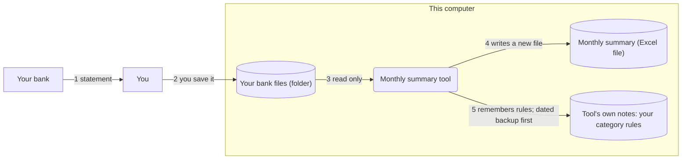
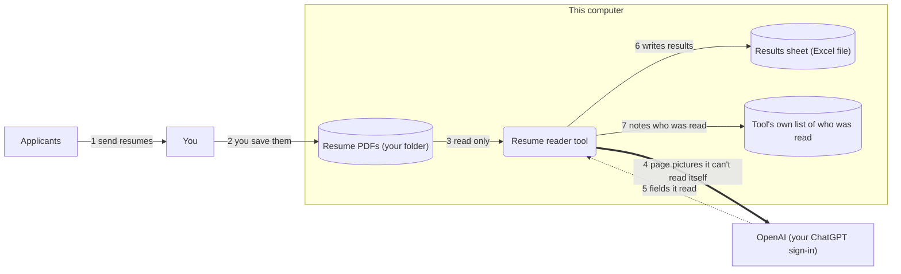

# Showing where a tool's data goes: UML, data flow diagrams and a plain "data map"

Scope: how the AI should model and show "the data part" of each tool: what data it handles, who and what touches it (the user, colleagues, a bank that makes the export, the AI service, Cloudflare), where it sits (the user's files, the tool's own data folder, backups, OpenAI, a website) and where it goes. The author suggested UML ("actors and stuff"). This note compares UML, data flow diagrams (DFDs, with trust boundaries) and the C4 system context diagram, checks which text-based diagram tools work under this skill's rules, and recommends one thing to do. It builds on the sketch rules in `stack.md`, the data rules in `safety.md`, the words file in [09](09-context-file.md) and the mockup findings in [05](05-mockups-alternatives.md). Research date 2026-09-30.

Tags: `[INFERENCE]` is my reasoning. `[UNVERIFIED]` means I could not confirm it in a primary source. `[LOCAL]` means I tested it on this machine (Windows 11, Edge/Chromium 154 headless, Bun). `[REPO]` is a fact about this repository's skill files as read today. UML 2.5.1 section numbers are from the OMG PDF [1], read by extracting its text; ISO texts are not used here.

## The problem this solves

One rule in the session brief has no way to be checked today: "The tool sends nothing anywhere without the user knowing where it goes" [REPO: `session-brief.md`]. "The user knowing" is only true if the user has seen, in plain words and in one place, every place their data sits and every place it goes. Right now that lives in scattered prose: "Where it is" and "Whose data" in the tool's NOTES, the AI feature text in `ai-features.md`, the website rules in `safety.md`. Nobody, the AI included, can look at one thing and say "this is everything".

There is a second, less obvious exit. Samples the user gives the AI go to OpenAI while the tool is being built, whether or not the finished tool ever sends anything [REPO: `safety.md`, "Whose data"]. A picture that says "nothing leaves this computer" and forgets that would mislead.

## What the picture has to be, for this skill

- **Text in the repo, kept by save points.** Save points take only `tools/<name>/NOTES.md` and `CONTEXT.md` per tool, plus a listed set of code and workbench files [REPO: `save.ps1` lines 20-25]. A new file type needs a line in both save scripts [REPO: `stack.md`, "Save points"]. Sketches are "never saved" [REPO: `stack.md`].
- **Viewable with nothing installed.** The sketch page allows only inline script and style: `default-src 'none'; style-src 'unsafe-inline'; script-src 'unsafe-inline'; img-src data:` [REPO: `stack.md`, "Sketches"].
- **No jargon.** The user is tech-savvy and does not write code. Notation names may appear in this note, never in what the AI says ([09](09-context-file.md)).
- **Checkable.** The AI must be able to compare it with the code and stop when they differ.
- **Small.** One person, small local tools, sometimes a few colleagues or a small private website. No certification, no paperwork for its own sake.

## The notations

| Notation | What it shows well for this purpose | What it hides | Readable for non-experts? |
|---|---|---|---|
| **UML use case diagram** | Who uses the tool for what. An Actor is "a role played by a user or any other system that interacts with the subject"; a UseCase is a set of actions that yields "an observable result that is of value" to actors [1 §18.2.1, §18.2.5]. The subject is drawn as a rectangle around the use cases [1 §18.1.4]. | Files, data, where anything sits, where anything goes. It shows people and goals, not data. | Doubtful. Of 11 professionals who use UML selectively, one found use case diagrams useful; one said "Black box use case specification is hard for people" [20]. |
| **UML activity diagram with partitions** | The closest UML has to the question. A swimlane (an ActivityPartition) groups steps by who performs them [1 §15.6.4.1]. An external partition (`isExternal = true`) is labelled `«external»` [1 §15.6.4.1, §15.7.7], and the spec's order example has a Customer lane, "external to the domain" [1 Fig. 15.70]. Object flows carry objects between steps [1 §15.7.22]. A DataStoreNode is "a CentralBufferNode for persistent data", drawn with `«datastore»` [1 §15.7.11, §15.4.4.3]. | Where a file physically sits. A swimlane says who acts, not where data lives, and UML has no "leaves this computer" concept here `[INFERENCE]`. It also brings forks, joins, decisions and token semantics the user never needs. | Unknown. No study found for activity diagrams with non-experts. Petre's interviewees used activity diagrams mainly with technical stakeholders, and one used a "swim laney thing" adapted by hand [20]. |
| **UML deployment diagram** | Where things sit. An Artifact is "a physical piece of information", for example "a table in a database system … a word-processing document, a mail message"; a Node is "computational resource upon which artifacts may be deployed"; a Deployment allocates an artifact to a node [1 §19.5.1, §19.5.10, §19.5.4]. That is "the summary file sits on this computer". | Who touches the data and how it moves. It is for "the execution architecture of systems" [1 §19.1]. Nodes are drawn as 3-D cubes [1 §19.2.4]. | Unknown; no study found. |
| **UML class diagram** | The layout of records: things, fields, links. Structure diagrams "show the static structure of the objects in a system … irrespective of time" [1 Annex A]. | Every place and every movement. Also drags in software ideas: one interviewee said a class model puts "some of the things … not things the person has told you" into the picture and pushes you to decide "how you're going to implement classes, inheritance" [20]. | Poor for this job. The user's "things" already live in `CONTEXT.md`; record layout is the AI's business (the "For the AI" section). |
| **Data flow diagram (DFD)** | Exactly the three questions: who is outside, where data sits, where it goes. Five symbols: external entity ("anything outside your control", including "systems run by other organizations"), process, data store ("anywhere data is stored, including files, databases…"), data flow, and trust boundary, a dashed closed shape [6]. Microsoft's tool draws the human user as a square, the web server as a circle, the database as two parallel lines, and trust boundaries as red dotted lines "to show where different entities are in control" [2][3]. OWASP calls DFDs "arguably the most common approach" to modelling a system for threat analysis and says they use "a small number of simple symbols" [4]. | Order and timing (a DFD is not a sequence). Whether a move is automatic or needs a click. The shape of the data. Classic DFDs need labels to say any of this `[INFERENCE]`. | Best evidence of the group, still thin (below). |
| **C4 system context diagram** | The tool as one box in the middle, "surrounded by its users and the other systems that it interacts with"; "the sort of diagram that you could show to non-technical people"; intended audience "everybody, both technical and non-technical" [7]. | Where data sits inside the tool (that is a lower C4 level), and it has no data-store or trust-boundary symbol at this level. The page states the audience claim without evidence [7]. | Claimed, not shown. Good as a mental model: the user and the tool in the middle. |

**DFDs and privacy.** Privacy threat modelling builds on DFDs. LINDDUN PRO starts from "a DFD system abstraction"; LINDDUN's MAESTRO method adds viewpoints for data subject, data lifecycle and data access [25]. Read plainly: "whose data" belongs on the map, not only "where".

### Evidence on non-experts: thin

I found no study of non-technical users reading pictures of their own small tools. What exists:

- **Laypeople and DFDs** (McInnis et al., 2025): eight focus groups, 34 adults, shown DFDs of a service's data handling with no training beyond clarifying questions. DFDs could supplement text and prompt questions, but "do not replace" it. Several found them confusing ("too busy … too complicated"). Participants wanted simple diagrams, straight lines (curves and loops distracted), a legend, and the person put in the middle; one asked "Where does it start?" [24]. This is opinion from focus groups, not a comprehension test, and the diagrams were about consent, not tools.
- **Graphics vs text** (Ottensooser et al., 2012): students with no training in process notation gained understanding from a text description but not from a BPMN diagram; trained readers gained from both [23]. It is BPMN, not DFDs, with students.
- **UML in industry** (Petre, 2013): 50 professionals, 35 do not use UML, 11 use it "selectively and informally"; two described past projects where clients "refused to sign it off, just too much detail, and they couldn't make sense of it" [20]. Everyone who talked about using it with stakeholders "emphasized the importance of keeping diagrams focused and as simple as possible" [20]. Counts are description, not statistics [20].
- **Notation design** (Moody, 2009, nine principles): summaries list a recommended maximum of about six symbols, text added to pictures (dual coding), ways to manage size, and different notations for different audiences [21][22]. I read the summary [22], not Moody's full text.
- **OWASP itself** says brainstorming on a whiteboard is "particularly useful when less technical individuals participate", because it removes "barriers to understanding and applying the components of DFD models" [4].

`[INFERENCE]` The signals agree on four things: keep it small, keep the user's words, put the same content in text next to the picture, and have the user check it against what they know. The recommendations follow those four. They are not proven for this audience; see "Open questions".

## The tools

| Option | Needs | Verdict |
|---|---|---|
| **Mermaid**, diagram types | The intro page lists flowchart, sequence, use case, Gantt, class, Git graph, ER (marked experimental), user journey, quadrant and XY chart [8]. Use case is `usecase-beta`, from Mermaid 12.0.0 [9]. C4 (context, container, component, dynamic, deployment) is "experimental" [10]. `architecture-beta` is for "services and resources commonly found within the Cloud", from 11.1.0 [11]. Flowcharts have a Data Store shape (from 11.3.0) and cylinder, folder and document shapes [12]. I found no activity or swimlane type in the list `[INFERENCE]`; flowchart subgraphs can draw lanes and boundaries `[LOCAL]`. | A browser and the Mermaid library. |
| **PlantUML** | `java -jar plantuml.jar`; Graphviz for everything except sequence diagrams [15]. Or the online server, which draws from the diagram text sent in the URL (`/plantuml/svg/ENCODED`) [16]. | Out. Java and Graphviz are installs; the server sends the diagram text to a third party `[INFERENCE]`. |
| **Mermaid in a Markdown viewer** | GitHub and GitLab draw a ```` ```mermaid ```` block in Markdown files [13][14]. | Fine for the author reading this note. The user's project is a local folder, so it doesn't help them `[INFERENCE]`. |
| **Codex CLI** | Draws Mermaid code blocks in the terminal from 0.156.0 (2026-09-22). 0.158.0 (2026-09-28): "unsupported diagrams explain why they fall back to source". 0.159.0 (2026-09-29): more flowchart edges and labels [17]. The renderer supports only subsets of flowchart, sequence, state, class and ER; flowchart subgraphs, styling, front matter and other shapes "return errors" and the caller keeps the source; limits are 16 nodes and 24 edges [19]. The 0.159.0 "node groups" most likely means `&` groups [19] `[INFERENCE]`. | Cannot show a "This computer" box (a subgraph) today. |
| **Codex desktop app** | The changelog mentions "Mermaid diagram error handling" in Codex app 26.226 (2026-02-26), "expanded Mermaid diagram labels" in the ChatGPT desktop app 26.707 (2026-07-09) and inline Mermaid in task transcripts on iOS (2026-07-20) [17]. A GitHub issue shows the Windows desktop app's **Markdown file preview** drawing Mermaid, with a regression after the 2026-09-17 update: wrong flow direction, decision shapes drawn as dashed rounded rectangles [18]. | **Chat rendering in the desktop app: `[UNVERIFIED]`.** The Codex docs pages I checked (app, app features, CLI features, projects, slash commands, config reference, what's new) never mention rendering, and the combined docs export mentions Mermaid once, as a syntax models can write [28]. I did not test the app's UI. |
| **Inline SVG in a sketch** | Nothing. `[LOCAL]` Under the exact sketch policy, an inline `<svg>` with arrow markers rendered, and the page reported no policy violations. | Works everywhere the sketch already works. |
| **A vendored Mermaid in a sketch** | `[LOCAL]` `<script src="mermaid.min.js">` is blocked by the sketch policy (`script-src-elem` violation), whether it points at a CDN or a sibling file. Pasting the library inline works: Mermaid 11.17.2 `mermaid.min.js` (3.57 MB) drew a flowchart with a subgraph and cylinders under the same policy, `securityLevel: 'strict'`, no console errors. jsDelivr lists `mermaid@12.0.0` `dist/mermaid.min.js` at 5.32 MB [LOCAL, from jsDelivr's file list]. | Technically fine, but every diagram file becomes 3.6-5.3 MB, and the library is one more pinned download to fetch and checksum like Node `[INFERENCE]`. |
| **A small generator that writes SVG** | `[LOCAL]` I built a prototype, about 60 lines of Bun, that reads a short list of boxes and arrows and writes one HTML file with an inline SVG: about 5 KB, no library. | Realistic. What I learned is in recommendation 5. |

## Recommendations

### A. What the AI draws

1. **Don't use UML with the user. Draw a plain "data map" that borrows from DFDs, UML swimlanes and C4.** Five parts, the same five as a DFD [6]:
   - an **outside party** (sharp rectangle): your bank, applicants, OpenAI, a colleague, Cloudflare;
   - **the tool** (rounded box);
   - a **place data sits** (drum): a folder of their files, the Excel file it writes, the tool's own notes, the backups;
   - an **arrow** for each move of data;
   - a dashed box around **"This computer"**, the trust boundary [6].

   From UML activity diagrams it takes the swimlane idea [1 §15.6.4.1] as three columns: "You and other people", "This computer", "Other companies' computers". From C4 it takes the shape of the context diagram, the tool in the middle and its surroundings around it [7]. The word "actor" is never shown. If someone else asks for UML, rec 12 has the translation.

2. **Keep the grammar tiny.**
   - At most about seven boxes, five shapes, straight lines, no legend to learn (several participants asked for a legend [24]; put it in words instead).
   - Every box uses a word from `CONTEXT.md` or a proper name (OpenAI, Cloudflare). No "database", "API", "server", "cloud", "token". Say "the tool's own notes", "sent to OpenAI", "Cloudflare, where your website lives".
   - Every arrow has a number, and below the picture the same numbers appear as one plain sentence each: "The tool reads it. It never changes your file." Numbers show order, which answers "Where does it start?" [24] and stop labels colliding with boxes `[LOCAL]`.
   - An arrow that goes from this computer to another company's is drawn thick and its sentence is bold. Colour is only an extra, never the signal [6].
   - One sentence always sits under the picture, even when the answer is "nothing": **"Leaves this computer: …"**.
   - If it needs more than about seven boxes, split it in two by time ("using the tool", "while we build it") instead of adding boxes. `[LOCAL]` At six boxes with numbered arrows the prototype was clear; at eight boxes and seven arrows two arrows crossed.

3. **The smallest useful map has four boxes.** You, the folder with their files, the tool, and what the tool writes. Add a box only when something new touches the data: another person, a company's computer (OpenAI, Cloudflare), the tool's own notes, backups worth mentioning. The "this computer" box is always drawn, because its emptiness on the right is the answer to the safety question.

### B. Where it lives and how the user sees it

4. **The record is two small tables in the tool's `NOTES.md`, under `## Data`, in a new "Where it goes" block after "Whose data".** No new file: the save scripts take only `NOTES.md` and `CONTEXT.md` per tool, a new file needs lines in both save scripts, and the startup hook already loads that tool's `NOTES.md` into every chat [REPO; see also [07](07-codex-host.md)]. Tables are Markdown, so they read fine anywhere, including in chat. About 12-20 lines. Names are generic ("a bank statement", never real names, amounts or numbers), as `safety.md` already requires for notes. Format is in the Template section below.

5. **The picture is generated from those tables, never drawn by hand, and saved as `tools/<name>/sketches/data-map.html`.** The tables are the single source, so the picture cannot show something the record doesn't. Sketches aren't saved, so it is simply made again when needed.
   - A small script (Node, already in `.tools`) reads the two tables and writes one HTML file: the sketch policy line, a "picture of where your data goes, not the tool itself" banner, an inline SVG, then the numbered sentences and the "Leaves this computer" line as HTML text.
   - **Fixed slots, not free layout.** `[LOCAL]` My first prototype put sentences on the arrows and let boxes fall where they came: labels collided at six boxes and one arrow ran straight through a box. Numbered arrows fixed the labels; a fixed layout fixed the crossing: left column for people and companies who give data, the "This computer" box in the middle (files in on top, the tool, then what it writes and keeps below), the column for other companies on the right. The AI writing free-form SVG coordinates each time would repeat my first attempt `[INFERENCE]`.
   - Where the script lives is the main agent's call. If it goes in `.workbench/scripts/`, that path is in the save scripts' explicit list [REPO: `save.ps1` line 20], so it needs a line there.

6. **In chat: the numbered sentences as plain text, the "Leaves this computer" line, and the HTML file opened. Never a ```` ```mermaid ```` block.** Reasons: chat rendering in the desktop app is `[UNVERIFIED]` and has already had one regression [18]; the CLI draws only a subset and would show raw source for a subgraph, which is the "This computer" box [19]; and raw Mermaid source is exactly the jargon wall the skill avoids. The numbered list works in every host and is the part that carries the meaning.

### C. When it appears

7. **Milestone 2, "the shape".** Right after the interview's "walk the workaround" (step 3 of `build.md` already asks what they open, copy and check, and who gets the result), the AI writes the two tables in NOTES and shows the picture in the shape demo. It replaces the "where their files come from … what they get and where it goes" sentence [REPO: `build.md`], it doesn't add a step. One question, with the AI's guess: "Is this right? Does anyone else get or see any of it?" The user is the expert on who gets what ([09](09-context-file.md), "Who the user is"); this question also surfaces things only in their head (rec 17 there), like "my manager sees the sheet". Nothing is built until they say OK (existing rule).

8. **Redraw, in one line, whenever the data path changes.** No new milestone. The triggers are events the skill already has:
   - an AI feature is chosen ([REPO: `ai-features.md`]);
   - the first real file is shown, when "Whose data" is answered;
   - a website or its first deploy;
   - someone else will use, receive or see the tool or its output ("When the tool grows");
   - a change in how data is stored (the `data-safety` block);
   - a rung on the sharing ladder.

   The AI says what changed: "I added OpenAI to the picture: step 4 sends a picture of each page it can't read itself." The old picture stays in save-point history through `NOTES.md`.

### D. Ties to safety and to the user's words

9. **Every arrow that crosses the dashed box gets a complete row.** The columns are in the Template below: what goes, who receives it, when (automatic, or only when the user clicks X), whose data it is, and whether it leaves this computer. The "Whose data" answer (their own, work with or without rules, other people's) is recorded once and linked, not asked again [REPO: `safety.md`]. Where the row carries other people's details, it is exactly where the existing forwardable question to IT attaches, and its text can be built from the row.

10. **The check that makes "sent nothing without them knowing" true.** At three moments: before milestone 4 (thinnest tool), before "Ship it", and before any save point for a change that touches network-facing code, the AI compares the Moves table with what the code can actually do, and stops on a mismatch.
    - Exits exist only if someone built them. The Electron starter cancels every request that isn't `app://local`, `blob:` or `data:`, and its CSP has `connect-src 'self'`; the single-file HTML starter has `connect-src 'none'`; "If the tool needs the network, that is a design decision with the user" [REPO: starters' READMEs, `main.ts`].
    - So the known exits are few: the `ai-read` block (it sends a picture of each page, one page at a time, only for pages the tool can't read as text) [REPO: `ai-features.md`]; a website's deploy through the starter's `deploy.mjs` to Cloudflare; anything handed to another person on the sharing ladder; and the always-there building exit, "samples I read in this chat go to OpenAI".
    - Rule: **exits in the code = arrows leaving the box in the table.** An exit with no row means stop, add the row, show the user. A row with no exit in the code is a stale row: fix it.
    - The mechanics are a search for the block's import, edits to the request allow-list in `main.ts`, and `wrangler`/`deploy.mjs` `[INFERENCE]`. It is grep-level; the starters' allow-list is the hard control.

    **Respect "Whose data".** The building exit is always a row in the table, because it is a fact. It is mentioned in chat, and in the "Leaves this computer" line, only under the same condition `safety.md` already sets for its one-line note: work with rules, or not sure, or other people's data. For "their own" or "work with no rules to mind" the rule "nothing more to say, now or later" stands [REPO: `safety.md`]. The map adds no warnings of its own.

11. **Tie to `CONTEXT.md`.** Things the data is called (the "Things" section) name the boxes and the "what" column; the verbs are the "Actions"; a "when … then …" rule from Rules becomes the "when" of a row ("only when you click Read resumes"), and "never change the original" becomes the "read only" arrows. A box with no word yet gets the naming dialogue from [09](09-context-file.md) rec 3: a name offered in a sentence about their own case, their answer decides. Add "the words on the map" to the pre-send check (09, rec 15).

### E. Staying current, sharing, asking for UML

12. **Kept current by being part of the change, not a chore.**
    - The tables are edited in the same change as the code, in step 6 of the loop when NOTES is updated ([REPO: `build.md`, "The loop"]).
    - The picture is regenerated, never edited.
    - The "every ~5 changes" tidy-up gains one check: "does the map still match?"
    - OWASP's rule for threat models fits at this size: it "should be maintained, updated and refined alongside the system" [4]. Microsoft's example team checks its model into source control [2]; here `NOTES.md` is in save points already, so `git log` on it answers "when did data start going to OpenAI?".
    - **Shared copies.** When each person builds their own copy (rung 2) or gets the zip (rung 3), the map goes into the hand-off note as the "where your data goes" section, and each copy's data stays with that person, as `safety.md` says. A **website** adds Cloudflare in the right column, a row for "the people you named open it after signing in with their email", and, only if the user chose public, "anyone with the link". A **shared or other people's data** row uses the words "other people's details" in its sentence.

13. **If IT, a colleague or a friend asks for UML or "a proper diagram":** draw it, the user decides; and say what it is called. The translation:

    | Data map part | DFD [6] | UML 2.5.1 [1] | C4 [7][10] |
    |---|---|---|---|
    | Outside party | external entity | Actor (§18.2.1); an `«external»` partition (§15.6.4.1) | Person, or software system outside the scope |
    | The tool | process | the subject of a use case (§18.1.4); an Activity | the software system in scope |
    | Place data sits | data store | DataStoreNode `«datastore»` (§15.7.11); for a file on disk, an Artifact deployed on a Node (§19.5.1, §19.5.10) | outside the context view; a container-level database |
    | Arrow | data flow | ObjectFlow (§15.7.22) | a labelled relationship |
    | "This computer" box | trust boundary | closest is a Node as a deployment target (§19.5.10) `[INFERENCE]` | Boundary / Enterprise boundary (Mermaid's C4 has both) |
    | Three columns | — | ActivityPartition swimlanes (§15.6.4.1) | — |

    Mermaid flowchart source may go into a forwardable message, as text, when the reader asked for a diagram. GitHub draws it [14]. It is for IT, not for the user, and the message rule "plain text in one block" [REPO: `safety.md`] still holds.

### What doesn't fit, and why

- **No threat modelling as a process.** No STRIDE, threat lists, ranking, trust levels or asset registers. They exist to find attackers' paths through a system [4][5]. The question here is smaller: does the user know where their data goes. Only the drawing is borrowed.
- **No class, use case, sequence or deployment diagrams for the user.** They show structure or goals, not where data sits and goes (table above). A record layout, when needed, goes in "For the AI" in NOTES.
- **No compliance framing.** Nothing here is a data-protection assessment or a certificate. Whether company rules apply is the user's answer in "Whose data", asked once [REPO: `safety.md`].
- **No per-field data inventory, retention schedule or diagram for its own sake.** One row per move, one line per place.
- **No Mermaid or PlantUML in the skill.** The first is fine as a notation for other readers (rec 13) but not something to depend on for the user's view (rec 6); the second needs installs [15].

## Template: what goes in `NOTES.md`

```markdown
## Data
Where it is: ...
Backups: ...
Whose data: ...
TOOL_ID: ...

### Where it goes
Places (drum = a place data sits; the tool is the rounded box)
| Place or party | Where | Notes |
|---|---|---|
| Your bank | outside | gives you the statement |
| Your bank files | this computer, your folder | never changed by the tool |
| Monthly summary | this computer, a file the tool writes | Excel |
| The tool's own notes | this computer, the tool's data folder | your category rules; dated backups |
| Sample copy | this computer, the tool's samples folder | a copy you gave me; kept apart from the tool |
| OpenAI | other companies' computers | your ChatGPT account; only while we build it |

Moves (numbers match the picture)
| # | From | To | What | When | Leaves this computer? |
|---|---|---|---|---|---|
| 1 | Your bank | You | a statement | you download it | no |
| 2 | You | Your bank files | the statement | you save it | no |
| 3 | Your bank files | The tool | the statement | when you click Make summary | no |
| 4 | The tool | Monthly summary | totals per category | same click | no |
| 5 | The tool | The tool's own notes | your category rules | when you change one | no |
| B | Sample copy | OpenAI | one statement | only while we build it | yes (building only) |

Leaves this computer: nothing while you use the tool. (Building only: the sample copy I read in this chat.)
```

Rules for the block: "Leaves this computer?" is `yes` or `no`, never blank. `B` rows are "building only" (the samples exit). "Whose data" is not repeated here; a row that carries other people's details says so in the "What" column ("resumes: applicants' details"). Sections are written when they get their first entry ([09](09-context-file.md) template rules).

## Worked examples

Example rows and pictures; the real ones come from the interview, in the user's words.

### 1. Bank CSV to a monthly Excel summary

Places and moves are the template above (the numbers there match this picture). Nothing crosses the box while the tool is used, so the right-hand column stays empty and the line under the picture says so.



(The Mermaid block is for readers of this note. The user gets the generated HTML picture and the numbered sentences.)

What the user sees in chat:

> Here is where your files go (I've opened a picture).
> 1. You download the statement from your bank.
> 2. You save it in your bank files folder.
> 3. The tool reads it. It never changes your file.
> 4. The tool writes a new Excel summary.
> 5. The tool remembers your category rules. It makes a dated backup before changing them.
>
> Leaves this computer: nothing.
> Is this right? Does anyone else get or see the summary?

If "Whose data" says work with rules, the last two lines become: "Leaves this computer: nothing while you use it. While we build it, the sample statement I read in this chat goes to OpenAI under your <personal or company> ChatGPT account."

### 2. Resume parser whose PDFs go to an AI service

| Place or party | Where | Notes |
|---|---|---|
| Applicants | outside | send resumes; their details |
| Resume PDFs | this computer, your folder | never changed |
| Results sheet | this computer, a file the tool writes | Excel |
| The tool's own list | this computer, the tool's data folder | who was read (file names, no resume text) |
| OpenAI | other companies' computers | through your ChatGPT sign-in |
| Sample resumes | this computer, the tool's samples folder | copies you gave me; kept apart from the tool |

| # | From | To | What | When | Leaves this computer? |
|---|---|---|---|---|---|
| 1 | Applicants | You | resumes | they email them | no |
| 2 | You | Resume PDFs | the resumes | you save them | no |
| 3 | Resume PDFs | The tool | the resumes | when you click Read resumes | no |
| 4 | The tool | OpenAI | a picture of each page it can't read as text, one page at a time (applicants' details) | same click | **yes** |
| 5 | OpenAI | The tool | the fields it read: name, jobs, skills | straight back | no |
| 6 | The tool | Results sheet | one row per resume; doubtful ones marked | same click | no |
| 7 | The tool | The tool's own list | who was read | same click | no |
| B | Sample resumes | OpenAI | a few resumes | only while we build it | yes (building only) |

Row 4 follows how the `ai-read` block works today: it reads a PDF page's text first and only sends a page picture when the page has no text [REPO: `ai-features.md`]. If that changes, the row changes.



`[LOCAL]` Both Mermaid blocks above drew without errors in Mermaid 11.17.2, and the generated HTML pictures for these two examples rendered under the sketch policy with no violations.

What the user sees, in short: the picture with arrow 4 drawn thick, then

> 4. **The tool sends a picture of each page it can't read as text, one page at a time, to OpenAI (your ChatGPT sign-in).** This leaves this computer, and it is the applicants' details.
>
> Leaves this computer: page pictures of resumes, at step 4.
> Is this right? Should anyone else see the results sheet?

Row 4 is where `safety.md`'s "Other people's data" line applies, the forwardable question to IT: "may that data be used this way?", with the row as its content [REPO: `safety.md`, "When the tool grows"].

## Open questions

- **Do users read the picture correctly?** Nothing found tests non-technical users on data maps of their own tools. The design leans on the four agreeing signals above; the real test is the user's reaction to "Is this right? Does anyone else get or see any of it?" at milestone 2. Worth a hands-on check with two or three users.
- **Does the Codex desktop app draw Mermaid in chat?** `[UNVERIFIED]`. The changelog and one issue say it draws it in Markdown previews [17][18]. Only relevant if the author later wants Mermaid in chat; the recommendation doesn't depend on it.
- **Does the generator survive real tools?** The prototype ran two examples in Edge headless [LOCAL]. It wasn't run on macOS, in the Electron window, or with a website (a fourth party, several outside boxes).
- **What OpenAI does with page pictures and samples** wasn't researched here; `safety.md` already carries the wording for that.
- **Whether the "node groups" in Codex 0.159.0 means subgraphs** `[UNVERIFIED]`; I read it as `&` groups [19].

## Sources

[1] Object Management Group, *Unified Modeling Language (UML) 2.5.1*, formal/17-12-05, https://www.omg.org/spec/UML/2.5.1/PDF (PDF downloaded and text extracted 2026-09-30). Sections used: Scope; Annex A; §15.4.4.3 (datastore notation), §15.6.4.1 (activity partitions), §15.7.7 (ActivityPartition, `isExternal`, Fig. 15.70), §15.7.11 (DataStoreNode), §15.7.22 (ObjectFlow); §18.1.4 (use case notation), §18.2.1 (Actor), §18.2.5 (UseCase); §19.1, §19.2.4, §19.5.1 (Artifact), §19.5.2 (CommunicationPath), §19.5.4 (Deployment), §19.5.10 (Node).
[2] Microsoft Learn, "Getting started - Microsoft Threat Modeling Tool", https://learn.microsoft.com/en-us/azure/security/develop/threat-modeling-tool-getting-started (opened 2026-09-30). The user as a square, web server as a circle, database as two parallel lines; trust boundaries "to show where different entities are in control"; a team checks the model into source control.
[3] Microsoft Learn, "Microsoft Threat Modeling Tool feature overview", https://learn.microsoft.com/en-us/azure/security/develop/threat-modeling-tool-feature-overview (opened 2026-09-30). Stencils: process, external interactor, data store, data flow, trust line/border boundary.
[4] OWASP Cheat Sheet Series, "Threat Modeling Cheat Sheet", https://cheatsheetseries.owasp.org/cheatsheets/Threat_Modeling_Cheat_Sheet.html (opened 2026-09-30). DFDs "arguably the most common approach", "small number of simple symbols"; whiteboarding "may be sufficient" but stored diagrams preferred; brainstorming useful with less technical people; a threat model "should be maintained, updated and refined alongside the system".
[5] OWASP Community, "Threat Modeling Process", https://owasp.org/www-community/Threat_Modeling_Process (opened 2026-09-30). Symbol table: external entity, process, data store, data flow, privilege (trust) boundary.
[6] Adam Shostack, "DFD3", https://github.com/adamshostack/DFD3 (opened 2026-09-30). Definition of a v3 DFD: five symbols, must not depend on colour, all elements labelled, dashed trust boundary.
[7] C4 model, "System context diagram", https://c4model.com/diagrams/system-context (opened 2026-09-30).
[8] Mermaid, "About Mermaid" (diagram types), https://mermaid.js.org/intro/ (opened 2026-09-30).
[9] Mermaid, "Use case diagrams (12.0.0+)", https://mermaid.js.org/syntax/usecase.html (opened 2026-09-30). Keyword `usecase-beta`, actors, system boundaries, include/extend.
[10] Mermaid, "C4 Diagrams", https://mermaid.js.org/syntax/c4.html (opened 2026-09-30). "Experimental"; context, container, component, dynamic, deployment; `Boundary`, `Enterprise_Boundary`, `Rel`.
[11] Mermaid, "Architecture Diagrams (v11.1.0+)", https://mermaid.js.org/syntax/architecture.html (opened 2026-09-30).
[12] Mermaid, "Flowcharts - Basic Syntax", https://mermaid.js.org/syntax/flowchart.html (opened 2026-09-30). Shapes, including Data Store (`datastore`, v11.3.0+), cylinder, folder, document.
[13] Mermaid, "Mermaid User Guide", https://mermaid.js.org/intro/getting-started.html (opened 2026-09-30). Ways to deploy (script tag/CDN import); native support in GitHub and GitLab Markdown.
[14] GitHub Docs, "Creating diagrams", https://docs.github.com/en/get-started/writing-on-github/working-with-advanced-formatting/creating-diagrams (opened 2026-09-30).
[15] PlantUML, "Local Installation notes", https://plantuml.com/faq-install (opened 2026-09-30). `java -jar plantuml.jar`; Graphviz for non-sequence diagrams.
[16] PlantUML, "PlantUML Server", https://plantuml.com/server (opened 2026-09-30). Diagram drawn from the encoded diagram text in the URL (`/plantuml/svg/ENCODED`); can be run locally.
[17] OpenAI, ChatGPT & Codex changelog, https://learn.chatgpt.com/docs/changelog (opened 2026-09-30). Codex CLI 0.156.0 (2026-09-22), 0.158.0 (2026-09-28), 0.159.0 (2026-09-29); Codex app 26.226 (2026-02-26); ChatGPT desktop app 26.707 (2026-07-09); ChatGPT for iOS 1.2026.195 (2026-07-20).
[18] openai/codex issue #47720, "Mermaid rendering regression after September 17 update", https://github.com/openai/codex/issues/47720 (opened 2026-09-30). Windows desktop app, Markdown file preview.
[19] openai/codex, `codex-rs/mermaid/README.md`, https://github.com/openai/codex/tree/main/codex-rs/mermaid (opened 2026-09-30). Supported subsets, unsupported syntax returns an error, size limits.
[20] Marian Petre, "UML in practice", ICSE 2013, pp. 722-731, https://oro.open.ac.uk/35805/ (accepted manuscript read at https://www.pragmadev.com/downloads/UmlInPractice.pdf, 2026-09-30). 50 interviews; five patterns of use; quotes on stakeholders, use case diagrams and class models.
[21] D. L. Moody, "The 'Physics' of Notations: Toward a Scientific Basis for Constructing Visual Notations in Software Engineering", IEEE Trans. Software Eng. 35(6), 756-779, 2009, https://research.utwente.nl/en/publications/the-physics-of-notations-toward-a-scientific-basis-for-constructi (bibliographic record only; full text not read).
[22] J. Ziehmann and B. Lantow, "Moody's Physics of Notations: High Impact, Little Support", PoEM'21 Forum, https://ceur-ws.org/Vol-3045/paper04.pdf (opened 2026-09-30). Secondary source for Moody's nine principles (semiotic clarity, perceptual discriminability, semantic transparency, complexity management, cognitive integration, visual expressiveness, dual coding, graphic economy with a recommended maximum of six symbols, cognitive fit).
[23] A. Ottensooser, A. Fekete, H. A. Reijers, J. Mendling, C. Menictas, "Making sense of business process descriptions: An experimental comparison of graphical and textual notations", J. Systems and Software 85(3), 596-606, 2012, https://research.wu.ac.at/en/publications/making-sense-of-business-process-descriptions-an-experimental-com-3/ (abstract read 2026-09-30).
[24] B. J. McInnis et al., "Using dataflow diagrams to support research informed consent data management communications: participant perspectives", JAMIA 32(4), 712-723, 2025, https://pmc.ncbi.nlm.nih.gov/articles/PMC12005621/ (opened 2026-09-30). Eight focus groups, 34 participants.
[25] LINDDUN, https://linddun.org/ and https://linddun.org/instructions/ (opened 2026-09-30). LINDDUN PRO starts from a DFD; MAESTRO adds data subject, data lifecycle and data access viewpoints.
[26] This repository, read 2026-09-30: `skills/workbench-setup/template/.workbench/session-brief.md`; `.workbench/scripts/save.ps1`; `.agents/skills/workbench/build.md`, `safety.md`, `stack.md`, `ai-features.md`, `starters/NOTES.md`, `starters/electron/README.md` and `src/main.ts`, `starters/html/README.md`, `blocks/data-safety/README.md`.
[27] Earlier notes in this folder: [05](05-mockups-alternatives.md) (sketches, the CSP line), [07](07-codex-host.md) (what the startup hook loads), [08](08-security-compliance.md) (whose data, forwardable messages), [09](09-context-file.md) (`CONTEXT.md`, the naming dialogue, the pre-send check).
[28] OpenAI, combined ChatGPT/Codex docs export, https://learn.chatgpt.com/docs/llms-full.txt (searched 2026-09-30). One mention of Mermaid, as a syntax models can write; no statement about rendering.
